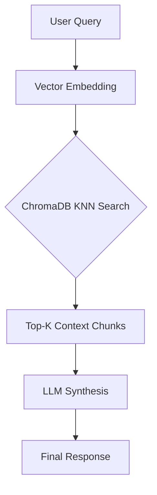

# Second Brain AI
> **Transform your personal documents into an intelligent, agentic knowledge base.**

Second Brain AI is a research-oriented RAG (Retrieval-Augmented Generation) system designed to bridge the gap between static document storage and active analytical assistance.

### Features
* **Semantic Intelligence:** Moves beyond keyword matching to high-dimensional vector similarity.
* **Mathematical Rigor:** Built with a focus on maximizing the Signal-to-Noise Ratio (SNR) in retrieval.
* **Performance First:** Powered by `uv` for blazing-fast dependency management and `Docker` for seamless portability.
* **Developer Friendly:** Native support for Kubuntu/Linux environments with Vim-friendly configurations.

### Tech Stack
- **Orchestration:** [LangChain](https://www.langchain.com/)
- **Interface:** [Gradio](https://gradio.app/)
- **Vector Engine:** [ChromaDB](https://www.trychroma.com/)
- **Environment:** [uv](https://github.com/astral-sh/uv) & [Docker](https://www.docker.com/)

---

## Technical Architecture

### **The Evolution: From Naive Search to Intelligent Synthesis**

#### **Stage 1: Naive RAG (Current State)**
The system currently implements a baseline RAG pipeline. While functional, initial benchmarks (archived in `eval/log/eval_log.py`) showed that simple similarity search often lacks global context.



**The Mathematical Logic:**
The `query` method projects natural language into an $n$-dimensional Hilbert space. It utilizes the **Cosine Similarity** coefficient to compute the proximity between the query vector $\mathbf{q}$ and document vectors $\mathbf{d}$:

$$\text{score}(\mathbf{q}, \mathbf{d}) = \frac{\mathbf{q} \cdot \mathbf{d}}{\|\mathbf{q}\| \|\mathbf{d}\|} = \frac{\sum_{i=1}^{n} q_i d_i}{\sqrt{\sum_{i=1}^{n} q_i^2} \sqrt{\sum_{i=1}^{n} d_i^2}}$$

The system solves an optimization problem to retrieve the best context:
$$\text{Results} = \text{arg}\max_{d \in D}^{k=3} \left( \text{score}(\mathbf{q}, \mathbf{d}) \right)$$

---

## Getting Started

### **Local Setup (Native)**
1. **Clone the repository:**
   ```bash
   git clone https://github.com/MdA-Saad/second-brain-ai.git
   cd second-brain-ai
   ```
2. **Environment Configuration:**
   Create a `.env` file and add your tokens:
   ```env
   HF_TOKEN=your_huggingface_token_here
   ```
3. **Run the App:**
   ```bash
   uv run python -m src.app
   ```

### **Docker Setup (Hassle-Free)**
To run the "Brain" in a completely isolated container with persistent memory:
```bash
# Build the image
docker build -t second-brain .

# Run with environment variables and persistent volume for ChromaDB
docker run -p 7860:7860 \
  -e HF_TOKEN="your_token_here" \
  -v $(pwd)/db:/app/db \
  second-brain
```

---

## Roadmap & Version Log

- **v1.0 (Current):** - Basic similarity-based RAG implementation.
    - Baseline performance logging in JSON/Python format.
    - **Issue identified:** Semantic drift where top-$k$ results miss user intent.
- **v1.1 (Next Sprint):** - Implementation of **LLM Synthesis** to clean up raw retrieval text.
    - Transition to **Query Rewriting** and **HyDE** (Hypothetical Document Embeddings) to improve retrieval precision.
- **v2.0 (Planned):** - **Agentic RAG:** Enabling the system to choose between different search tools and databases dynamically.

